[](https://github.com/gamerhat18/Quick-VM/)


# Quick-VM (WORK IN PROGRESS) 

Setup a Windows VM very easily and quickly on any Arch, Debian or Fedora system using RedHat KVM. 

>Now that [NVIDIA has enabled GPU Passthrough for Windows based Virtual Machines](https://nvidia.custhelp.com/app/answers/detail/a_id/5173) (no more Code 43!), this project will also include easy setup and configuration for passing through NVIDIA GPUs in KVM and interfacing Windows apps from linux via [WinApps](https://github.com/Fmstrat/winapps/).
>
>Till then, read [Single GPU Passthrough](https://github.com/joeknock90/Single-GPU-Passthrough) and [Arch Wiki - PCI Passthrough](https://wiki.archlinux.org/index.php/PCI_passthrough_via_OVMF).

# 🚀 Getting Started

### 🌟 Simple Install:

1. Download [Windows 10 Pro ISO](https://www.microsoft.com/en-us/software-download/windows10ISO), and [VirtIO Drivers (Stable)](https://fedorapeople.org/groups/virt/virtio-win/direct-downloads/stable-virtio/virtio-win.iso)

2. Place the ISOs in either `~/WindowsVM/` or `/var/lib/libvirt/images/`.

3. Rename the ISOs as shown below:
    - **Windows 10 ISO** ➜ `win10.iso`
    - **VirtIO Drivers** ➜ `virtio-win.iso`

4. Open your terminal and enter the command shown below  

### 🪄 One-liner to Setup KVM - Paste this in your terminal

```bash
bash <(curl -sL https://git.io/JOeOs) 
 ```

> Here is the [Script](https://github.com/thegamerhat/quick-vm/blob/main/one-liner.sh)

### 🖥 Host System Requirements:
 
  - **Ubuntu 18.04** or newer
  - **Fedora 31** or newer
  - **Arch** (Read this [Guide by LinuxHint](https://linuxhint.com/install_configure_kvm_archlinux) for permissions and User Group setting)
  - **4 CPUs** (2 Multi-Threaded Cores at minimum)
  - **8 GiB Memory** (more = better)
  - **40+ GiB of Free Storage** typically (**SSD Recommened**)
  
> **Linux Kernel 5.4 LTS** or newer is recommended 

<p>
<details>
<summary>Default specs of the VM</summary>
<br>

**CPU**: 4 vCPUs Allocated

**GPU**: VirtIO or [VFIO GPU Passthrough - ArchWiki](https://wiki.archlinux.org/index.php/PCI_passthrough_via_OVMF) or [Single-GPU-Passthrough](https://github.com/joeknock90/Single-GPU-Passthrough) 

**Memory**: Total 6 GiB, 1 GiB Allocated initially

**Storage Drive**: 1 TB VirtIO Disk (Dynamically Allocated)

**DVD Drive**: Windows 10 ISO

**Other Drives**: VirtIO Drivers ISO, Essential Tools ISO (to optimize VM performance)

**Network Card**: VirtIO (Recommended Disabled until debloated)
</br>
</details>
</p>

### ✅ Getting the VM Ready:

<p>
<details>
<summary>Step by Step Guide - Click Me!</summary>
<br>

### Please follow along the screenshots below to get the VM ready.

+ Click inside the VM Window and press any key when asked.  

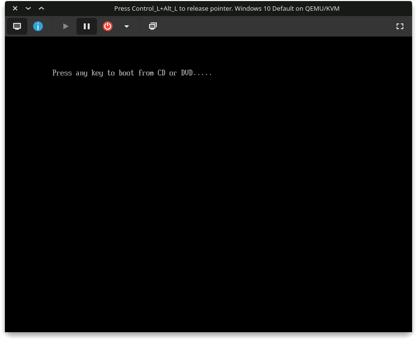

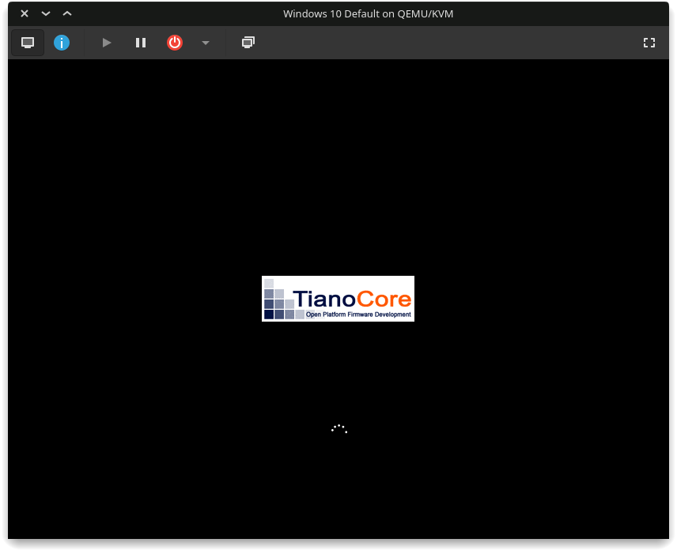

+ Select your language and keyboard input and click Next.

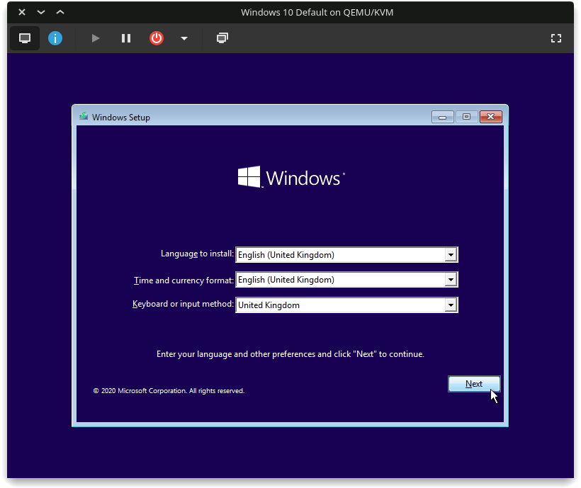

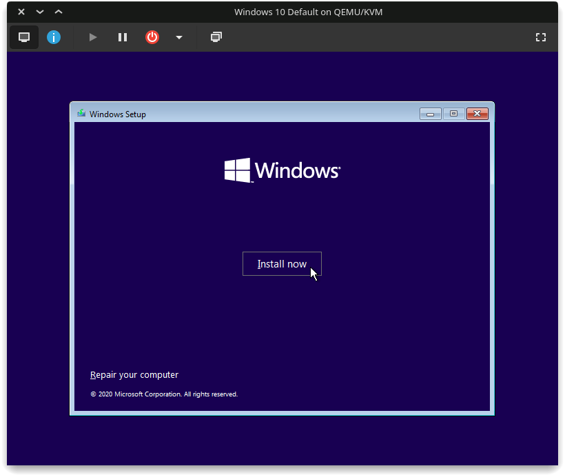

+ Enter your product key now, or you can skip and enter your product key after installation.

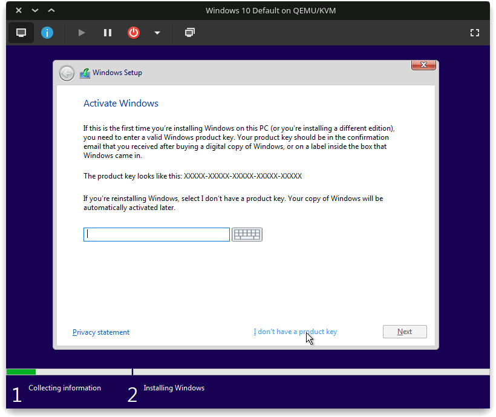

+ Selecting **Windows 10 Pro N** will install **Windows 10 Pro** without extra bloat.
> Note: Choose Windows 10 Pro XXX or Enterprise if you need Hyper-V for Stealth VM. 

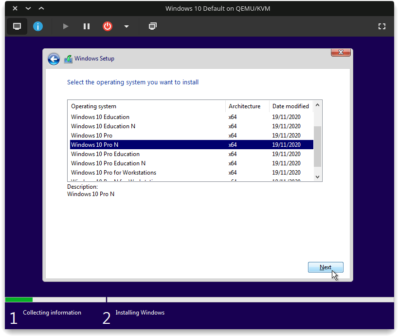

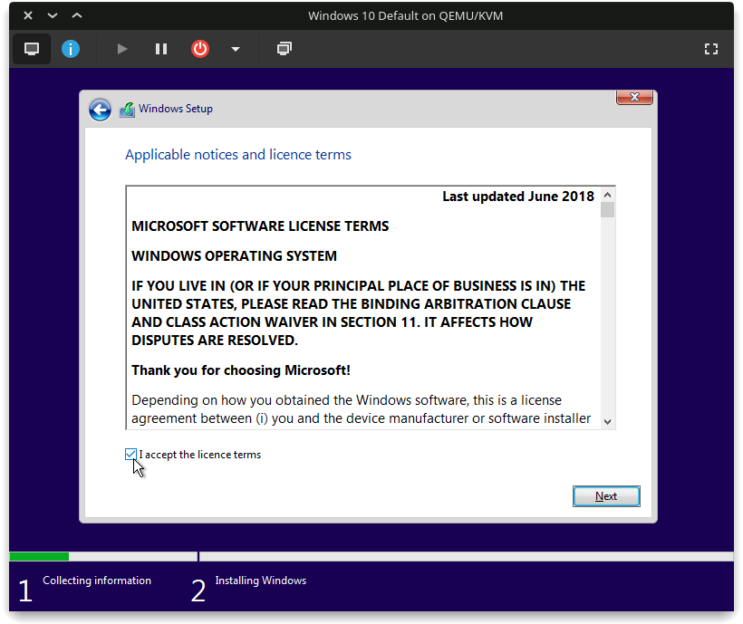

+ Select **Custom Install**  (because the other one is useless)

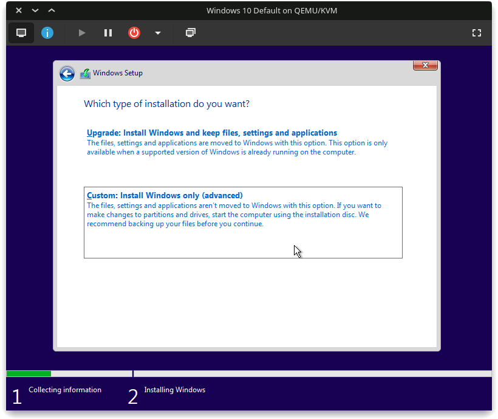

+ Click on **Load Driver** to install disk drivers.

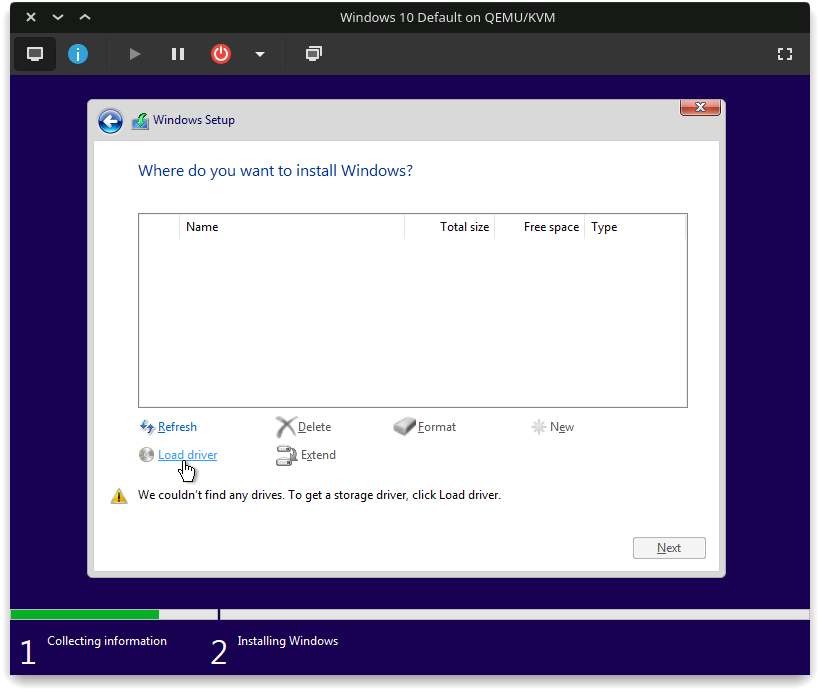

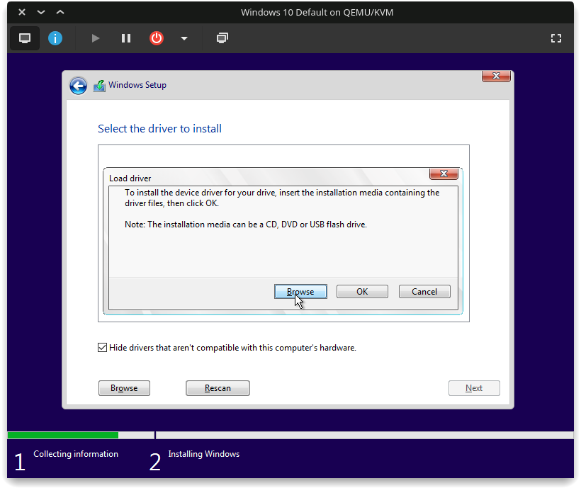

+ Double-Click on **CD Drive virtio-win** ➜ **amd64** ➜ **w10** and click **OK**. 

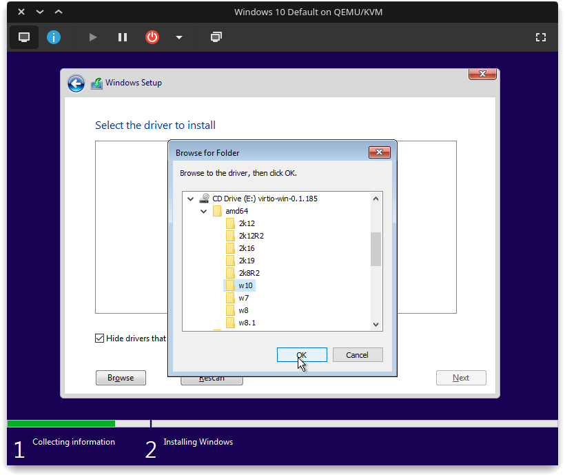

+ Just click N**ext** to select the default one.

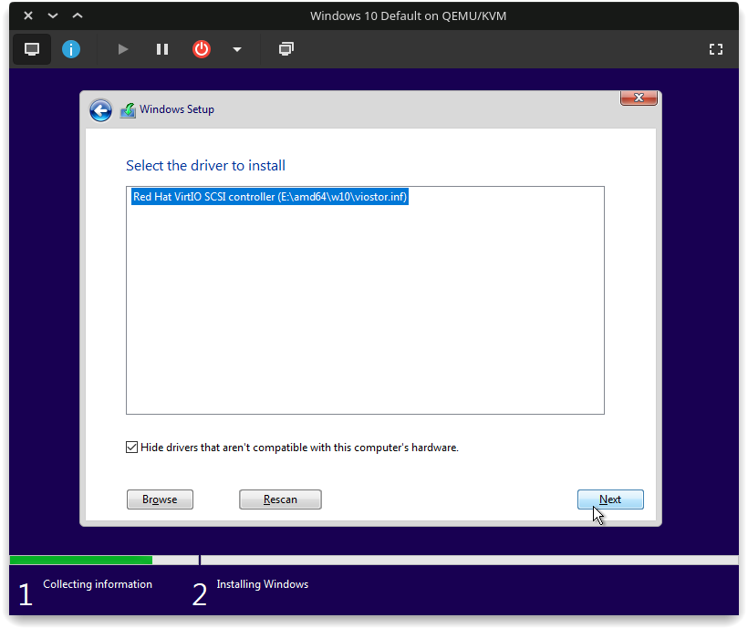

+ Select `Unallocated Space` and click **Next** to begin the installation.

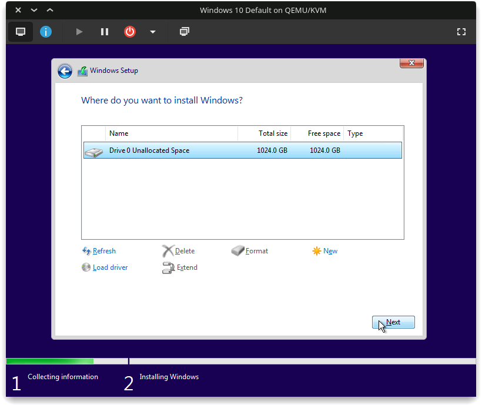

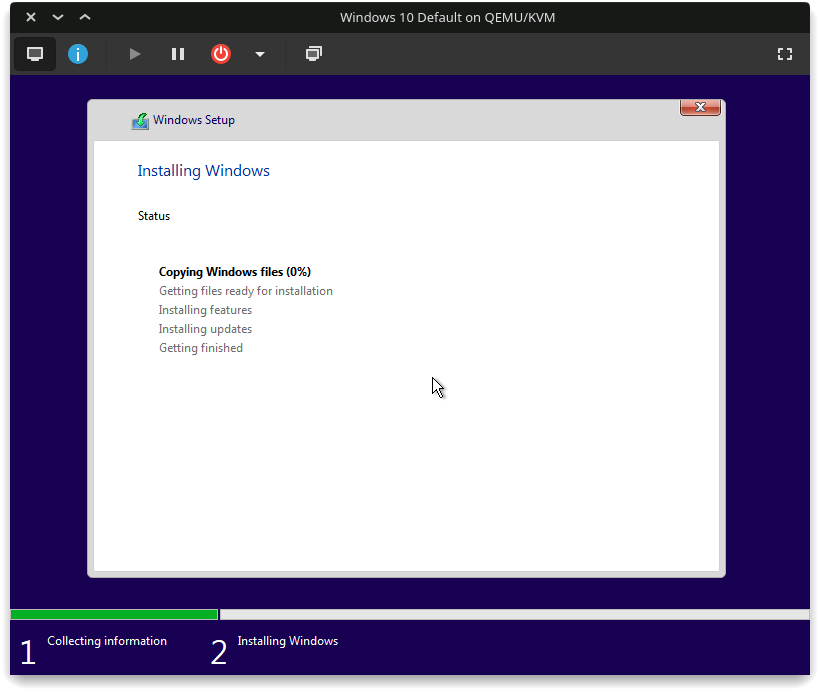


</br>
</details>
</p>


## ⚔️ Advanced Install

<p>
<details>
<summary>📍 Check KVM Compatibility</summary>
<br>

1. Checks if `AMD-V` or `VT-d`/`VT-x` is supported on your AMD/Intel CPU.
2. Checks if kvm is enabled using `virt-host-validate`.</br>
</details>
</p>

<p>
<details>
<summary>📍 Install required packages</summary>
<br>

- Updates repositories (Debian and Fedora only) and installs required packages.

```
# Debian
sudo apt update -q && sudo apt install -y qemu qemu-kvm libvirt-bin libvirt-daemon libvirt-clients bridge-utils virt-manager

# Fedora
sudo dnf -y install qemu-kvm libvirt bridge-utils virt-install virt-manager

# Arch
sudo pacman -S --noconfirm qemu libvirt bridge-utils edk2-ovmf vde2 ebtables dnsmasq openbsd-netcat virt-manager
```
</br>
</details>
</p>

<p>
<details>
<summary>📍 Enable Libvirt Service & Virtual Networking</summary>
<br>

**Executes the following commands only if systemd is present and running.**

```
# Libvirt service and socket
sudo systemctl enable --now libvirtd

# Virtlogd
sudo systemctl enable --now virtlogd

# Virtual Networking
sudo virsh net-autostart default
sudo virsh net-start default
```
</br>
</details>
</p>

<p>
<details>
<summary>📍 Locate ISOs</summary>
<br>

1. Checks if `win10.iso` and `virtio-win.iso` exist in ~/WindowsVM or /var/lib/libvirt/images
2. Uses `rsync` to copy the ISOs to /var/lib/libvirt/images (_$HOME subdirectories might cause permission issues_)

</br>
</details>
</p>

<p>
<details>
<summary>📍 Reload KVM Kernel Modules</summary>
<br>

If `kvm` is enabled correctly, then executes the following commands depending upon the CPU.

```
# AMD
sudo modprobe -r kvm_amd kvm      # safely unloads the modules
sudo modprobe kvm                 # enables kvm first
sudo modprobe kvm_amd nested=1    # then kvm_amd module with nested enabled

# INTEL
sudo modprobe -r kvm_intel kvm    # safely unloads the modules
sudo modprobe kvm                 # enables kvm first
sudo modprobe kvm_intel nested=   # then kvm_intel module with nested enabled
```
</br>
</details>
</p>

📍 [Making a Stealth VM](docs/stealth-vm.md)

📍 [DIY VM (Everything From Scratch)](docs/diy-vm.md)

## 🔌 TODO-notes

- you'll also likely need `vendor-reset` for cards suffering from the AMD reset bug (RX 5000 and older).
- (maybe?) IOMMU and VFIO
- GPU Passthrough after IOMMU
- Stealth VM notes
- Make separate disks for each stealth vm, with their own qcow2
- remove virtio From stealth VM
- GPU Passthrough options and notes
- AMD GPUs can use `vendor_id="AuthenticAMD"`
- Single GPU Passthrough for NVIDIA and AMD

## Feature ideas

- ask user to enter the path to the isos instead of putting it in one folder (just for giving an option to the user)
- 

## 📬 Contact me


[](mailto:gamerhat18@gmail.com) 
[](https://github.com/thegamerhat) 
[](https://linkedin.com/in/pranav-kulkarni-94b975180) 
[](https://twitter.com/gamerhat18)

