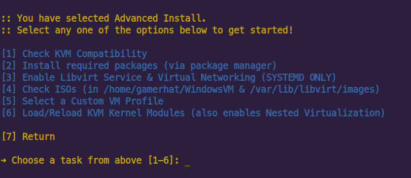
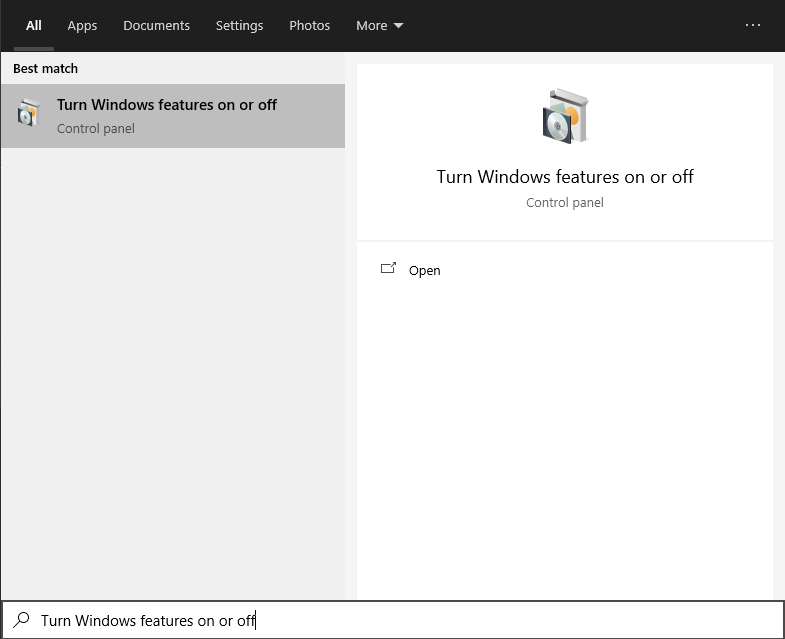
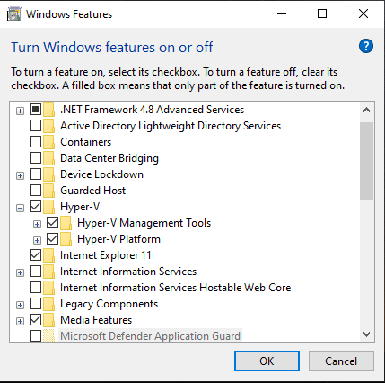

[](https://github.com/gamerhat18/Quick-VM/)


# Quick-VM (WORK IN PROGRESS) 

Setup a Windows VM very easily and quickly on any Arch, Debian or Fedora system using RedHat KVM. 

>Now that [NVIDIA has enabled GPU Passthrough for Windows based Virtual Machines](https://nvidia.custhelp.com/app/answers/detail/a_id/5173) (no more Code 43!), this project will also include easy setup and configuration for passing through NVIDIA GPUs in KVM and interfacing Windows apps from linux via [WinApps](https://github.com/Fmstrat/winapps/).
>Till then, read [Single GPU Passthrough](https://github.com/joeknock90/Single-GPU-Passthrough) and [Arch Wiki - PCI Passthrough](https://wiki.archlinux.org/index.php/PCI_passthrough_via_OVMF).

# 🚀 Getting Started

### 🌟 Simple Method:

1. Download [Windows 10 Pro ISO](https://www.microsoft.com/en-us/software-download/windows10ISO), and [VirtIO Drivers (Stable)](https://fedorapeople.org/groups/virt/virtio-win/direct-downloads/stable-virtio/virtio-win.iso)

2. Place the ISOs in either `~/WindowsVM/` or `/var/lib/libvirt/images/`.

3. Rename the ISOs as shown below:
    - **Windows 10 ISO** ➜ `win10.iso`
    - **VirtIO Drivers** ➜ `virtio-win.iso`

4. Open your terminal and enter the command shown below  

### 🪄 One-liner to Setup KVM - Paste this in your terminal

```bash
bash <(curl -sL https://git.io/JqtJc) 
 ```

> Here is the [Script](https://github.com/gamerhat18/quick-vm/blob/main/one-liner.sh)

### 🖥 Host System Requirements:
 
  - **Ubuntu 18.04** or newer
  - **Fedora 30** or newer
  - **Arch** (You can read this [Guide by LinuxHint](https://linuxhint.com/install_configure_kvm_archlinux) for permissions and User Group setup)
  - **4 CPUs** (2 Hyperthreaded Cores at minimum)
  - **8 GiB Memory** (in total)
  - **40+ GiB of Free Storage** (For a typical install, **SSD Recommened**)
> **Linux Kernel 5.4 LTS** or newer is recommended 

### Default specs of the VM:

>**CPU**: 4 vCPUs Allocated
>
>**GPU**: VirtIO or [VFIO GPU Passthrough - ArchWiki](https://wiki.archlinux.org/index.php/PCI_passthrough_via_OVMF) or [Single-GPU-Passthrough](https://github.com/joeknock90/Single-GPU-Passthrough) 
>
>**Memory**: Total 6 GiB, 1 GiB Allocated initially
>
>**Primary Drive**: 1 TB VirtIO Disk (Dynamically Allocated)
>
>**Secondary Drive**: Windows 10 ISO
>
>**Other Drives**: VirtIO Drivers ISO, Essential Tools ISO (to optimize VM performance)
>
>**Network Card**: VirtIO (Recommended Disabled until debloated)


## ⚔️ Advanced Install Method

### Making a VM Stealthy...

If you need to mask your VM from checks that a few programs do to restrict users from using certain programs inside a VM for various reasons (like Video Games), then this section is for you.

> It is recommended to not install VirtIO drivers if you are going to passthrough a GPU (onboard/dedicated).

- Select `Advanced Setup` and go to `Select a Custom VM Profile`
- From there, select `Create a Stealth VM`, and you will have a Stealthy VM ready (almost) in a few seconds.

| Select the Stealth Profile |
| --- |
|  |

- In `Advanced Setup` select `Load/Reload KVM Kernel Modules` to enable Nested Virtualization.

| Modprobe - Enable Nested Virtualization |
| --- |
|  |

- Once you are past the Windows Install, go to **Turn Windows Features On or Off**.

| Search for Windows Features menu |
| --- |
|  |

- Click the ▼ dropdown menu for **Hyper-V**, and check both of the boxes as shown below.

| Enable Hyper-V |
| --- |
|  |

-


## 🛸 DIY (Manual Method)

<p>
<details>
<summary>Manual Step-by-Step-Process</summary>
<br>

### First, you must install the required packages on your system. You may search the packages in your package manager or compile them yourself.

<p>
<details>
<summary>Installing Dependencies</summary>
<br>


#### Install Qemu-KVM, Virt-Manager, Libvirt and other dependencies on your distro.
 

**Note:** Any Linux distribution will work just fine. You do need to install `libvirt`, `virt-manager`, `qemu`, and other required dependencies.

 ```bash
# Debian & Ubuntu (Linux Mint, PopOS, ElementaryOS)
sudo apt install -y qemu qemu-kvm libvirt-bin libvirt-daemon libvirt-clients bridge-utils virt-manager
``` 

 ```bash
# Fedora based ditros  
sudo dnf -y install qemu-kvm libvirt bridge-utils virt-install virt-manager
``` 

```bash
# Arch (Manjaro, Arco Linux, EndeavourOS) 
sudo pacman -S --noconfirm qemu libvirt bridge-utils edk2-ovmf vde2 ebtables dnsmasq openbsd-netcat virt-manager
 ```

### After installing the dependencies, make sure you enable `libvirtd.service`

```bash
 # Enable Libvirt Service
 sudo systemctl enable --now libvirtd

 # Enable VM Console logging 
 sudo systemctl enable --now virtlogd 

 # Enable Virtual Network Bridge 
 sudo virsh net-autostart default
 sudo virsh net-start default
 ```
 
</br> 
</details>
</p>
 
> **Linux Kernel 5.4 LTS** or newer is recommended
 
## Download the Windows 10 ISO and KVM VirtIO drivers

You will need **Windows 10 Pro/Pro N**, as it has RDP Support which is needed if you want to run Windows Apps under Linux. You will also need drivers for VirtIO to ensure the best performance with the least overhead on your system.
 
- Download [VirtIO Drivers (Stable)](https://fedorapeople.org/groups/virt/virtio-win/direct-downloads/stable-virtio/virtio-win.iso) from FedoraPeople

- Download [Official Windows 10 ISO](https://www.microsoft.com/en-us/software-download/windows10ISO) from Microsoft 

> You may even supply your own custom Windows Image (like Windows Ameliorated Edition)
 

**Note:** Place the ISOs in `~/WindowsVM` , as this script points to that directory to find those ISOs. You can change the location in the `kvm/Windows10-Vanilla.xml` file if you prefer.


### Make sure you rename both of the ISOs as following:

**Windows 10 ISO** ➜ `win10.iso`

**VirtIO Drivers** ➜ `virtio-win.iso`


</br>
</details>
</p>

## 🔌 TODO-notes

- you'll also likely need `vendor-reset` for cards suffering from the AMD reset bug (RX 5000 and older).
- Stealth VM notes
- Make separate VM XML files for all profiles, with their own qcow2
- remove virtio From stealth VM
- GPU Passthrough options and notes
- AMD GPUs can use `vendor_id="AuthenticAMD"`

## 📬 Contact me


[](mailto:pranavkulkarni195@gmail.com) 
[](https://github.com/gamerhat18) 
[](https://linkedin.com/in/pranav-kulkarni-94b975180) 
[](https://twitter.com/gamerhat18)

