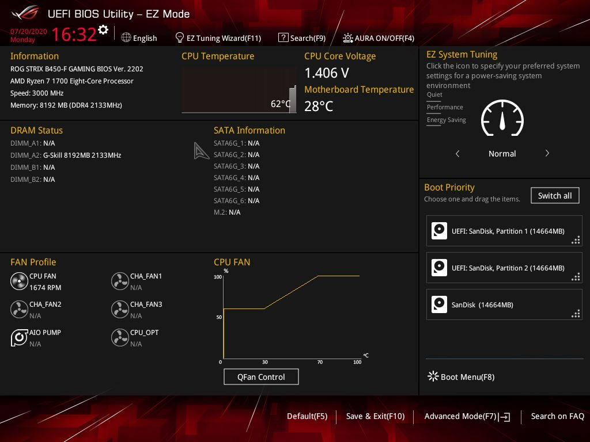
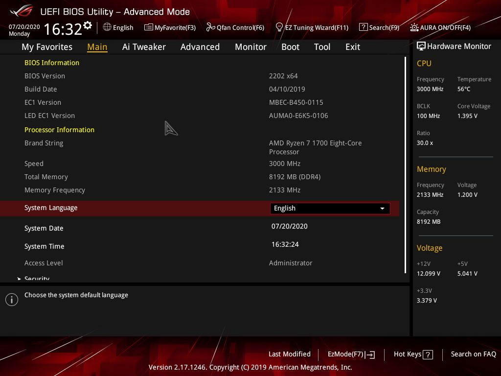
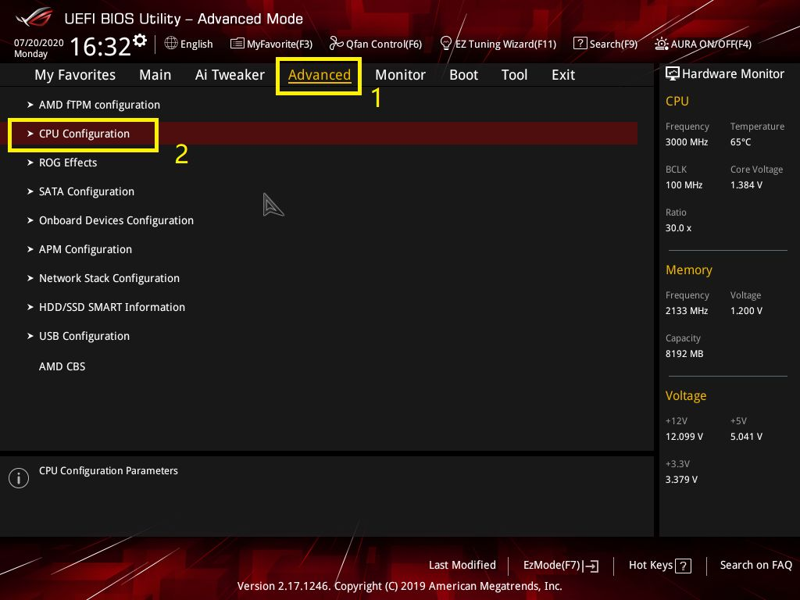
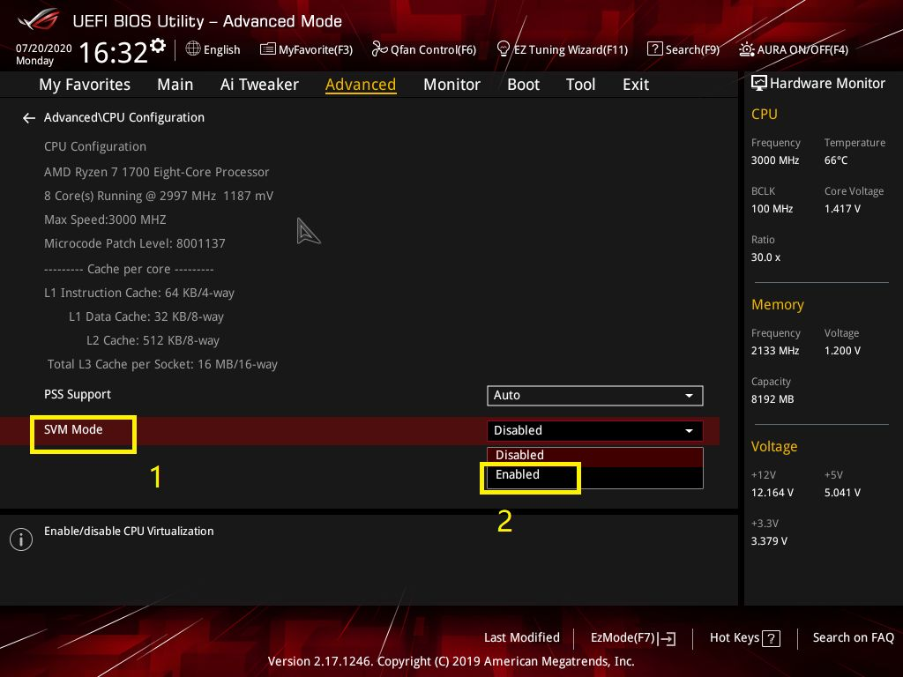
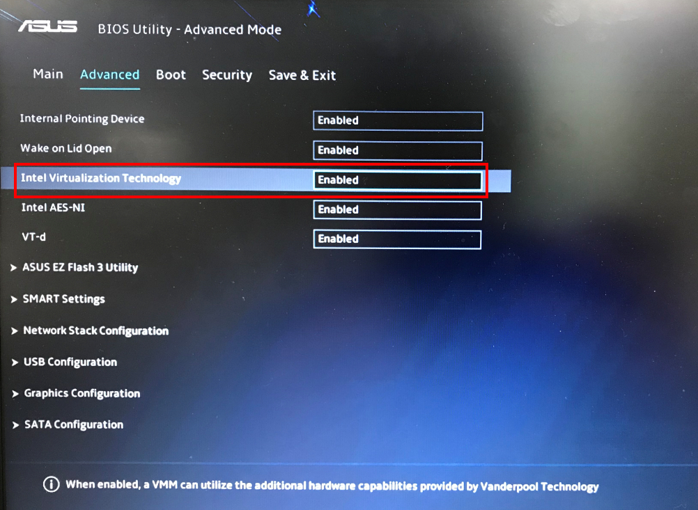
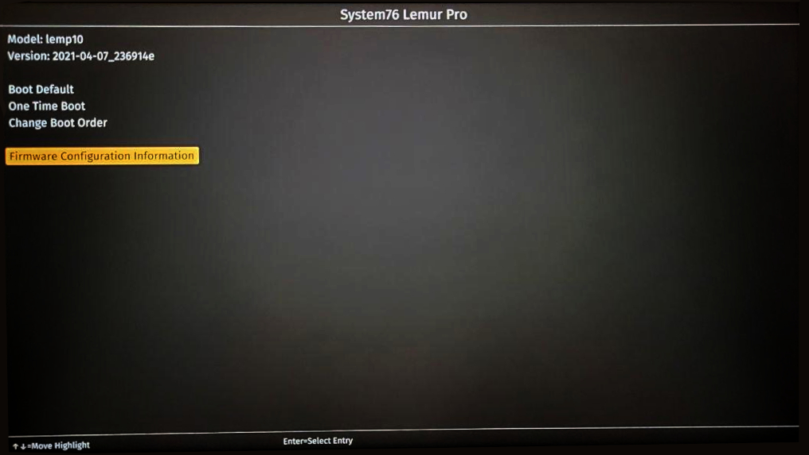
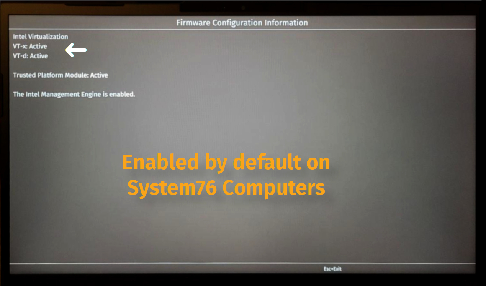
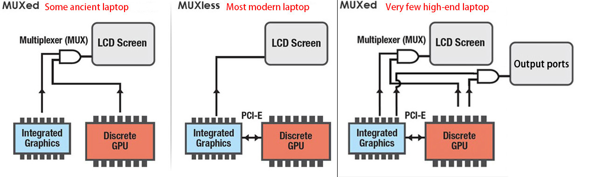

# 🛸 DIY From Scratch

**UPDATE:** Windows 11 will be supported once Microsoft releases an official ISO in early 2022.

If you want to go adjust every little aspect of the VM to suit your needs, this section is for you. This guide works regardless of your Linux distribution.

NOTE: Using a recent version of Windows is recommended (anything after 20H1 or May 2020) as older revisions are known to have some issues, and hence are not mentioned in this guide.

## Enabling Virtualization in your UEFI/Coreboot

You may need to enable **AMD-V** or Intel **VT-x/VT-d** depending on your CPU brand in your UEFI before going further. 

**THIS VARIES BETWEEN VARIOUS MOTHERBOARDS**

Take a look at how to do it below:

<p>
<details>
<summary>How to enable Virtualization on your Motherboard</summary>
<br>

**STEPS WILL VARY BETWEEN DIFFERENT MOTHERBOARD MANUFACTURERS**

Please follow the steps to enable virtualization (SVM) in the BIOS for AMD motherboards:

#### 1. Press `Del` or `F2` in the keyboard after power on, then press `F7` to enter into Advanced Mode(ROG series motherboard can directly enter into Advanced Mode, no need to press `F7`)



#### 2. Click `F7` if you are not in advanced mode already



#### 3. Click [Advanced] - [CPU Configuration] 



#### 4. Enable Virtualization based on your CPU [INTEL or AMD] 

- **Enable SVM (AMD)**



- **Enable VT-x and Intel Virtualization (Intel)**


- **OLD BIOS (Intel and AMD)**



#### 5. Finally, **Save** and **Reboot**.

>Instructions and media taken from Asus Forums.

</br>
</details>
</p>


<p>
<details>
<summary>Verify on System76 Computers</summary>
<br>





</br>
</details>
</p>

If you have a laptop with UEFI, you can also [check this video](https://youtu.be/NbnPWhI4xis).

For Coreboot devices, refer to your manufacturer's instructions or check the official documentation [here](https://coreboot.org/status/kconfig-options.html). 

## Installing Dependencies 

Boot into your preferred Linux OS and install the packages. You may search the packages in your package manager or compile them yourself.

<p>
<details>
<summary>Installing Dependencies</summary>
<br>

### Install Qemu-KVM, Virt-Manager, Libvirt and other dependencies on your distro.

**Note:** Any Linux distribution will work just fine. You do need to install `libvirt`, `virt-manager`, `qemu`, and other required dependencies.

 ```bash
# Debian & Ubuntu (Linux Mint, PopOS, ElementaryOS)
sudo apt install -y qemu qemu-kvm libvirt-bin libvirt-daemon libvirt-clients bridge-utils virt-manager
``` 

 ```bash
# Fedora based ditros  
sudo dnf -y install qemu-kvm libvirt bridge-utils virt-install virt-manager
``` 

```bash
# Arch (Manjaro, Arco Linux, EndeavourOS) 
sudo pacman -S --noconfirm qemu libvirt bridge-utils edk2-ovmf vde2 ebtables dnsmasq openbsd-netcat virt-manager
 ```

### After installing the dependencies, make sure you enable the following services.

Instead of `Systemd`, you can use `OpenRC`, `Runit`, `SysVinit` as well.

```bash
 # Enable Libvirt Service
 sudo systemctl enable --now libvirtd

 # Enable VM Console logging 
 sudo systemctl enable --now virtlogd 

 # Enable Virtual Network Bridge 
 sudo virsh net-autostart default
 sudo virsh net-start default
 ```
</br> 
</details>
</p>

> **Linux Kernel 5.4 LTS** or newer is recommended
 

## Downloading ISOs

If you want to run Anti-Cheat games and use Winapps, you will need **Windows 10 Pro/Pro N/Pro Workstation/Enterprise**, as they have Hyper-V Support which is required.
 
- Download [Windows 10 Pro ISO](https://www.microsoft.com/en-us/software-download/windows10ISO), and [VirtIO Drivers (Stable)](https://fedorapeople.org/groups/virt/virtio-win/direct-downloads/stable-virtio/virtio-win.iso)

> You may even supply your own custom Windows Image (like Windows Ameliorated Edition)

**Note:** Place ISOs in `/var/lib/libvirt/images/` to avoid permission issues.

## Creating a VM

<p>
<details>
<summary>Step by Step Guide - Click Me!</summary>
<br>

+ Open Virt Manager from your applications menu or type `virt-manager` in terminal.

+ Click on the ➕ icon or the first icon in Virt Manager to create a VM.


+ Select the Windows 10 ISO that you downloaded earlier, and choose the OS from the list if it isn't detected automatically.


+ Allocate Memory and CPUs as per requirement.


+ Either create a new disk or create one as big as you want, and later select the disk here.
You can enter any directory you wish, as well as how big you want it to be.

+ Enter this command to create a disk.
`qemu-img create -f qcow2 /var/lib/libvirt/images/Windows10Vanilla.qcow2 1024G`


+ Check `Customize configuration before install` and click **Finish**.


+ In the Overview section, Select `OVMF_CODE.fd` in Firmware.


+ In the CPU section, check `Copy host CPU configuration` if you aren't planning to make a Stealth VM, and `host-passthrough` otherwise.

+ You may manually set `CPU Topology` if you know the exact layout of your CPU.

>for example: **Ryzen 5 3600** has `6 Cores`, `12 Threads` and is only available in `1 Socket` motherboards.


+ In the Memory section, enter `Current allocation = 1024` to make initial RAM usage less.


+ In SATA Disk section, Change the `Disk Bus` to `VirtIO` to make operations faster by reducing overhead.


+ In NIC section, Change the `Device model` to `VirtIO` to enable Virtual Network Bridge for interfacing between VM and Host.


+ Click **Add Hardware** and select the Storage section to add VirtIO Drivers ISO and change the `Device type` to `CDROM device` and click Finish.


+ In the Boot Options section, select Windows ISO CDROM and VirtIO Disk that we created earlier, and check 'Enable boot menu'.

+ Finally, Click `Begin Installation` to save and start the VM.


> If you encounter an OVMF/edk2 problem, check out [OVMF Fix](https://wiki.archlinux.org/index.php/PCI_passthrough_via_OVMF#Cannot_boot_after_upgrading_ovmf)
>
> **Or you can enter the following command in terminal (only applicable this VM)**
>
> Ubuntu/Debian ➜ `sudo cp /usr/share/OVMF/OVMF_CODE.fd /var/lib/libvirt/qemu/nvram/Windows10-default_VARS.fd `
>
> Fedora ➜ `sudo cp /usr/share/edk2/ovmf/OVMF_CODE.fd /var/lib/libvirt/qemu/nvram/Windows10-default_VARS.fd`
>
> Arch ➜ `sudo cp /usr/share/ovmf/x64/OVMF_VARS.fd /var/lib/libvirt/qemu/nvram/Windows10-default_VARS.fd`

+ Click inside the VM Window and press any key when asked.  


+ Select your language and keyboard input and click Next.


+ Enter your product key now, or you can skip and enter your product key after installation.


+ Selecting **Windows 10 Pro N** will install **Windows 10 Pro** without extra bloat.
> Note: Choose Windows 10 Pro XXX or Enterprise if you need Hyper-V for Stealth VM. 


+ Select **Custom Install**  (because the other one is useless)


+ Click on **Load Driver** to install disk drivers.


+ Double-Click on **CD Drive virtio-win** ➜ **amd64** ➜ **w10** and click **OK**. 


+ Just click N**ext** to select the default one.


+ Select `Unallocated Space` and click **Next** to begin the installation.


+ After installation, Windows will boot normally and you will need to set up your user account and password.

+ Avoid Microsoft Sign in if you can at all 😉 

</br>
</details>
</p>

## Optimization

There usually isn't much that needs to be done for optimizing Performance in VM, but there are a couple of things that need to be taken into consideration for more than just a basic VM.

- [CPU Pinning](https://mathiashueber.com/performance-tweaks-gaming-on-virtual-machines/#CPU_Pinning) for better CPU Allocation.

- [Huge Memory Pages](https://mathiashueber.com/configuring-hugepages-use-virtual-machine/) for less overhead on systems with lot of memory allocation.

- [Other Small issues](https://mathiashueber.com/qemu-troubleshooting-errors-gpu-passthrough-vm/) that do come from time to time.

## GPU Passthrough 

**TLDR;** 

**Writen Guides**:
  - [Ubuntu/Pop OS 20.04 Guide](https://mathiashueber.com/pci-passthrough-ubuntu-2004-virtual-machine/)
  - [ArchWiki PCI Passthrough via OVMF](https://wiki.archlinux.org/index.php/PCI_passthrough_via_OVMF)
  - [Gentoo Guide](https://wiki.gentoo.org/wiki/GPU_passthrough_with_libvirt_qemu_kvm)

**Video Guides**: 
  - [TechTeamGB Ubuntu NVIDIA Passthrough](https://www.youtube.com/watch?v=NDgiV7Lgku8) 
  - [SomeOrdinaryGamers' Arch NVIDIA Passthrough](https://www.youtube.com/watch?v=h7SG7ccjn-g)
  - [Level1Linux Fedora Passthrough](https://www.youtube.com/watch?v=aLeWg11ZBn0) 

For laptops, see [Laptop Compatibility](https://github.com/thegamerhat/quick-vm/blob/main/docs/diy-vm.md#-laptop-compatibility)

---

**Ideally you need to have 2 GPUs (one dedicated and one integrated) in order to access Windows as well as Linux desktop simultaneously, by using 2 monitors or switching the display output on one monitor.**

However, if you are living in the world after 2020, I know your pain and why you have only one (or possibly none) GPU.

You might be in one of the following situations:

  1. You ONLY have one GPU, either discrete GPU (NVIDIA/AMD RX) or integrated Graphics (Intel/AMD Radeon)
  2. You have a discrete GPU (NVIDIA/AMD) + integrated Graphics (Intel UHD/AMD Radeon)
  3. You have two discrete GPUs (then integrated graphics don't matter)

Refer the following sections according to your current system specifications. If your system has,

### Only one discrete GPU (no iGPU):

  1. [SomeOrdinaryGamers' Single GPU Passhrough Video (NVIDIA)](https://youtube.com/watch?v=BUSrdUoedTo)
  2. [Fedora 34 Single GPU Passthrough on Level1Forums](https://forum.level1techs.com/t/single-gpu-passthrough-on-fedora-34/)
  3. [joeknock90 central repository](https://github.com/joeknock90/Single-GPU-Passthrough)

> NOTE: Before you passthrough your GPU, make sure you enable your integrated graphics and set it to default in UEFI/Coreboot first, or else you won't be able to view your Linux Host.

### One discrete GPU to dedicate completely to the VM:

  1. [Level1Tech's GPU Passthrough Guide](https://www.youtube.com/watch?v=aLeWg11ZBn0)
  2. [SomeOrdinaryGamers' KVM Guide](https://www.youtube.com/watch?v=h7SG7ccjn-g)

> In the past, it was required that you have two different GPUs (typically AMD + NVIDIA), but that's not the case anymore!

> NOTE: The GPU used by the VM will be unavailable for the Linux System for use. Using the iGPU/low-cost GPU for the Linux system is recommended.

### Only integrated graphics:

- [Lan Tian's Intel GPU iPasshrough Guide](https://lantian.pub/en/article/modify-computer/laptop-intel-nvidia-optimus-passthrough.lantian/)

---

If you want to be able to use GPU Accelerated Applications (like Video Games, Adobe CC, etc) on a Windows VM without dedicating an entire monitor to Windows VM, check out the **Looking Glass** Project:

  - [Looking Glass](https://looking-glass.io) - An extremely low latency Memory-to-Memory frame copy from the Guest to Host.
  - [Level1Techs Video](https://www.youtube.com/watch?v=okMGtwfiXMo) - It has gotten better than what this video demonstrates!

### Code 43/Black Screen fix 

NVIDIA's driver **465** and newer support GPU Passthrough to a Windows Guest on a Linux Host.

Check out [**LinusTechTips' Video**](https://www.youtube.com/watch?v=JGvrXXonoqM), [**Wendell's Video**](https://www.youtube.com/watch?v=kCNPdih6gbg) and [**SomeOrdarinaryGamers' Video**](https://www.youtube.com/watch?v=eR6Q1YhCIbk) to get an idea about what could be possible down the line.

>**NOTE**: NVIDIA still doesn't support SR-IOV so you will need an iGPU or a separate GPU if you want to be able to access the Linux Host.
>
>If you don't want to use a second GPU, check out [Single GPU Passthrough](https://github.com/joeknock90/Single-GPU-Passthrough)

### Check Out [**NVIDIA GRID on GeForce and Quadro GPUs**](https://github.com/DualCoder/vgpu_unlock), which is NVIDIA's Proprietary alternative to SR-IOV, and you need a functioning NVIDIA Tesla GPU in your system to get this trick working.
You can read the [Community made Wiki](https://docs.google.com/document/d/1pzrWJ9h-zANCtyqRgS7Vzla0Y8Ea2-5z2HEi4X75d2Q/edit).

So if you need to passthrough an NVIDIA or AMD GPU without making it obvious that you are using a VM, add the following lines to your XML.

**1. List all VMs**

```bash
sudo virsh list --all
```


**2. Edit the VM config**

+ Replace `Windows10` with the name shown in the previous step.

```bash
sudo virsh edit Windows10
```

**3. Enter the following text between the already existing sections**

#### You can replace `randomid` with `AuthenticAMD` to fix a few issues on RX 5000 and older AMD GPUs. 

```bash
...
<features>
...
  <hyperv>
  ...
    <vendor_id state="on" value="randomid"> 

  </hyperv>
  
  <kvm>
      <hidden state="on"/>
  </kvm>
...
</features>
```

## Gotchas

For any issues not just limited to the following, check the following sections on the Arch Wiki.

[**Section 1**](https://wiki.archlinux.org/index.php/PCI_passthrough_via_OVMF#Gotchas_1):
- Unisolated IOMMU Groupings
- Problems with vfio-pci loading correctly

[**Section 2**](https://wiki.archlinux.org/index.php/PCI_passthrough_via_OVMF#Gotchas_2):
- Using a non-EFI image on EFI based VM

[**Section 3**](https://wiki.archlinux.org/index.php/PCI_passthrough_via_OVMF#Gotchas_3):
- Passing through a device that does not support resetting via kernel

## 💻 Laptop Compatibility



According to the image above, if you have a MUXless laptop, it is a little tricky to dedicate your GPU to a VM and have its own separate display, because the GPU doesn't connect to the HDMI/DisplayPort Port directly, and instead uses the iGPU as a bridge to the laptop screen.
Read more about it on [this post in Level1Forums](https://forum.level1techs.com/t/implications-of-muxed-muxless-laptops-for-gpu-passthrough/129165)

You might be able to get around this by passing the iGPU to the VM, as [shown here](https://lantian.pub/en/article/modify-computer/laptop-intel-nvidia-optimus-passthrough.lantian)

You can still get past through this sometimes like [this reddit post](https://www.reddit.com/r/VFIO/comments/hx5j8q/success_with_laptop_gpu_passthrough_on_asus_rog/) mentions, using an **ROG Zephyrus G14** w/ **RTX 2060**.

### NVIDIA Issues on Laptops

Sometimes on Optimus/Max-Q laptops, NVIDIA wants to check for the battery info in Windows or else it returns **Code 43**.

If you experience that issue, check out the [SSDT Workaround](https://wiki.archlinux.org/index.php/PCI_passthrough_via_OVMF#%22Error_43:_Driver_failed_to_load%22_with_mobile_(Optimus/max-q)_nvidia_GPUs) on ArchWiki.

If you still get a **Code 43**, perhaps [batmanfeynman's post](https://www.reddit.com/r/VFIO/comments/mqxhus/code_43_on_optimus_laptop_help/) or [alterNERDtive's post](https://www.reddit.com/r/VFIO/comments/mqz2gt/solved_nvidia_passthrough_post_driver_465_code_43/) could help.

## AMD Reset Bug Fixes

- For Polaris, Vega and Gen1 Navi Reset fix, installing [vendor-reset](https://github.com/gnif/vendor-reset) is enough thanks to [gnif](https://github.com/gnif).
- For RX 5000, check out [Navi Reset Bug Kernel V2](https://forum.level1techs.com/t/navi-reset-bug-kernel-patch-v2/163103/14)
- Also see the recent [Pop! OS 20.10 VFIO 5700XT](https://forum.level1techs.com/t/pop-os-20-10-vfio-5700xt-pain/169647/2) post

## Making your VM Stealth

If you need to mask your VM from checks that a few programs do to restrict users from using certain programs inside a VM for various reasons (like Video Games), then this section is for you.

It goes over running DRM/Anti-Cheat games under VMs that have built in VM detection techniques.

### 🔖 [Guide on Stealthy VM](stealth-vm.md)
